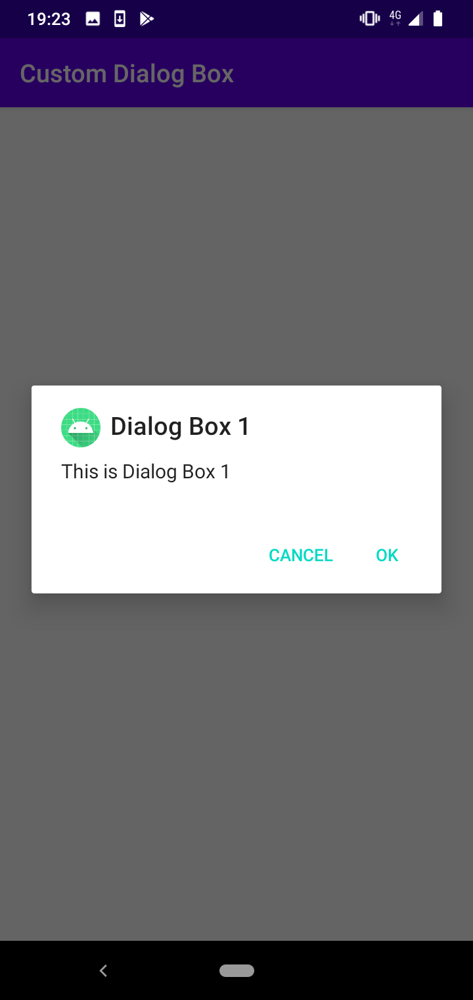

# Custom Dialog Box

In this code I show you how to create a custom dialog box that can execute methods when the user presses "OK" or "CANCEL". I provide you with an easy template to follow so you can integrate any custom dialog box into your Android Application.

# Tools

- ConstraintLayout
- Alert Dialog

# Images

# Author

Created by Mohamed Sobhy on 2020. Copyright © 2020 Mohamed Sobhy. [LinkedIn](https://www.linkedin.com/in/mohamed-sobhy-040958181/)

# Environment

This project was generated by Android Studio 4.0.0 and Java 

# Further Help

To get more help on the project, you can contact with me by email address m7md.sob7y20@gmail.com

# Note

This project created on 2020, some libraries or code might be depreciated.
